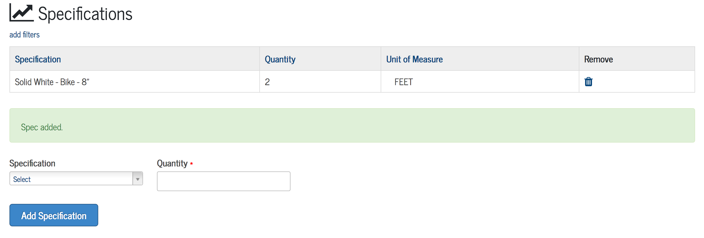

[Data Tracker Guides](./) > [Signs & Markings](/signs_markings#signs-and-markings-data-tracker-user-guides) > [Task Management](task_management.md)

# Managing Work Tasks

- [About Tasks](#about-tasks)
- [Create a Task](#create-a-task)
- [Find Tasks](#find-tasks)
- [Complete a Task](#complete-a-task)
- [Re-Open a Task](#re-open-a-task)
- [Cancel a Task](#cancel-a-task)

## About Tasks

Each work order contains one or more **tasks** which are to be completed by individual workgroups (Long Line, Short Line, Specialty Markings, etc.). A task may have one of four statuses:

- *NEW*: The task has not been issued to the workgroup.
- *ISSUED*: The task is ready to be completed by the workgroup.
- *COMPLETED*: The task has been completed by workgroup and submitted for review.
- *HOLD*: The work order has been placed on hold.

## Create a Task

There are two mechanisms for creating tasks:

##### Auto-Generated Tasks
When a Markings work order is created, tasks for each of the selected workgroups are created automatically. See [Create a Work Order](create_work_order_non_tech.md) for more details.

##### Manually Create a Task
Tasks can be manually added to any work order, provided the work order is is not **CLOSED** or **ON HOLD**. See [Manage Work Orders (COMING SOON)](#TODO) for more details.

## Find Tasks

**User Role Required**: Viewer

1. Visit the tasks landing page: http://transportation.austintexas.io/data-tracker/#home/work-tasks-markings/

2. By default, the Tasks table displays tasks which have been ISSUED to work groups. Each row in the table represents a single tasks that must be completed, and the tasks are grouped by the workgroup assigned to the task. Additional tabs display work orders that are NEW, COMPLETED, and on HOLD.

3. The search box at the top of the tasks table enabes searching by keyword. Partial words are accepted.

4. To view a task's details, click on the details icon in the left-most column of the table.

## Complete a Task

**User Role Required**: Technician

1. Follow the steps in [Find Tasks](#find-tasks) to find and view **Task Details**.

    The **Task Details** page displays relevant information about the work task, as well as forms to submit information about work that was completed.

2. Scroll down the page to find tables for Time, Specifications, and Materials. There is a form below each table which will allow you to submit entries for each section of the work task. 

    **Note**: The task entry forms will only be displayed if the task has status of **ISSUED** and if the user's role is **Technician**.

3. To add an entry for any section of the **Task Details**, complete the form fields in the section, then click the blue button to submit the form. A green confirmation message will confirm that the entry was successfully submitted, and a new row will display in that section's entry table.

    

    *The Specifications section with a successfully-submitted entry*

4. Continue to add entries for Time, Specifications, and Materials as needed. You may remove entries from by clicking the trash bin icon under the **Remove** column of any of the task tables.

5. Once at least one entry has been submitted for each section of the work order\*, it is possible to mark the task as completed. To complete the work task, click the **Complete Task** button at the top of the **Task Details** page.

6. From the confirmation window that appears, click the blue **Complete Task** button to mark the task as completed.

    *\*Note: Specifications are not required for the Raised Pavement Markings (RPM) group*

## Re-Open a Task

**User Role Required**: Technician

A completed task may be re-opened if it meets the following conditions:

- The task's status is **COMPLETED**
- The work order status is not **CLOSED** or **ON HOLD**

1. To re-open a task, click the **Re-Open Task** button at the top of the **Task Details** page.

2. From the confirmation window that appears, click the blue **Re-Open Tasks** button to re-open the task.

## Cancel a Task

**User Role Required**: Technician

A task may be cancelled if it meets the following conditions:

- No Time, Specifications, or Materials entries have been added to the task.
- The task status is **NEW** or **ISSUED**

1. To cancel a task, click the **Cancel Task** button at the top of the **Task Details** page.

2. From the confirmation window that appears, click the blue **Cancel Tasks** button to cancel the task.

