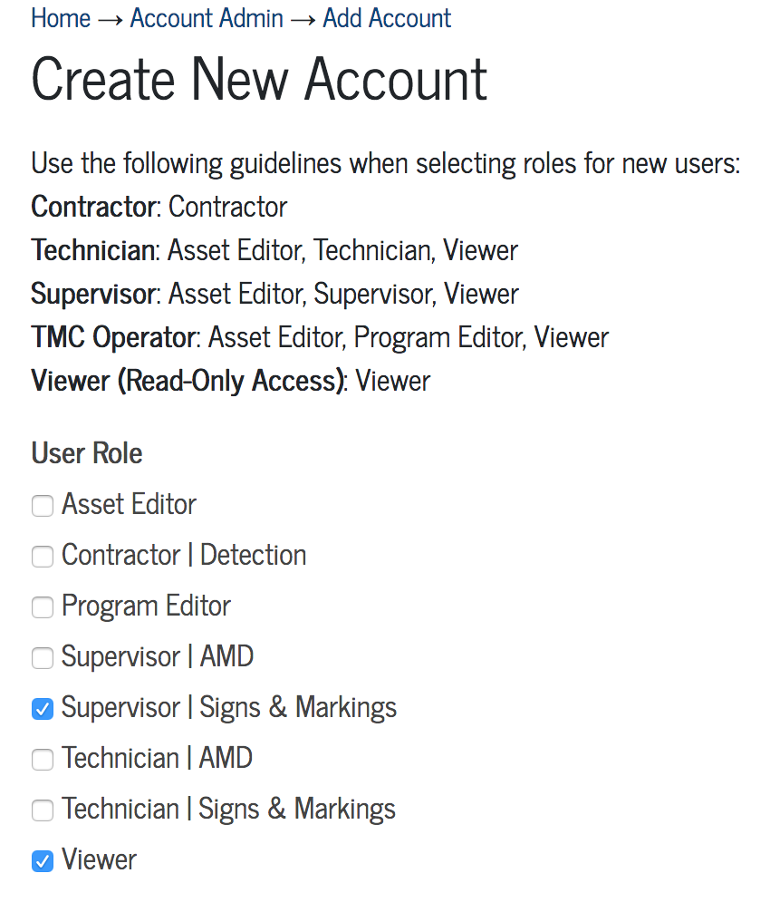

[Data Tracker Guides](./) > [Signs & Markings](/signs_markings#signs-and-markings-data-tracker-user-guides) > [User Management](user_management.md)

# User Management

- [About User Accounts](#about-user-accounts)
- [Create a New User Account](#create-a-new-user-account)
- [Modify a User Account](#modify-a-user-account)

## About User Accounts

In order to create user accounts or modify user permissions, a user must be desiginated as an **Account Administrator**. Contact your workgroup's system administrator for information about account administration.

Signs & Markings users are assigned one of three roles: Viewer, Technician, or Supervisor. The below table summarizes which actions are permitted by each role.

User Role       | Create Work Orders | Edit Work Orders | Close Work Orders |Create Tasks | Issue Tasks | Edit Tasks
:---            | :---:              | :---:            | :---:             |:---:        | :---:       | :---:
**Viewer**      | Yes                | Yes              | No                |Yes          | No          | No
**Technician**  | Yes                | Yes              | No                |Yes          | No          | Yes
**Supervisor**  | Yes                | Yes              | Yes               |Yes          | Yes         | Yes

## Create a New User Account

##### User role required: Account Administrator

1. Login to the [Account Admin](http://transportation.austintexas.io/data-tracker/#home/account-admin2/add-account/) page.

2. Click the **Add Account** button at the top of the page.

3. Complete the **New Account** You will need to select each user role that applies to the account you are creating. Follow the instructions on the form to select the appropriate role for the account:

    

    *Selecting user roles when creating an account.*

For example, to create a signal technician user, you will select the user roles Asset Editor, Technician \| Signs & Markings, and Viewer.

4. Once you have completed the new user form, click **Create Account** to create the new user account. The user will be sent instructions via e-mail to complete their account registration.

5. As a reminder, any user who is unable to login to their Data Tracker account may use the "Forgot?" password link on the login page to reset their password.

## Modify a User Account

##### User role required: Account Administrator

1. Login to the [Account Admin](http://transportation.austintexas.io/data-tracker/#home/account-admin2/add-account/) page.

2. Use the **search** box at the top of the User Accounts table to find the account you wish to modify.

3. Click the **Edit Account** icon in the right-most column of the User Accounts table.

4. Update the account as needed and click **Update Account** to save changes. See [Create a User Account](#create-a-new–user-account) for more details about selecting user roles.

